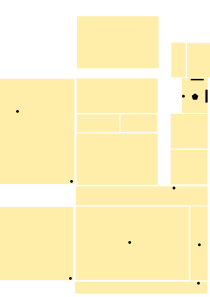
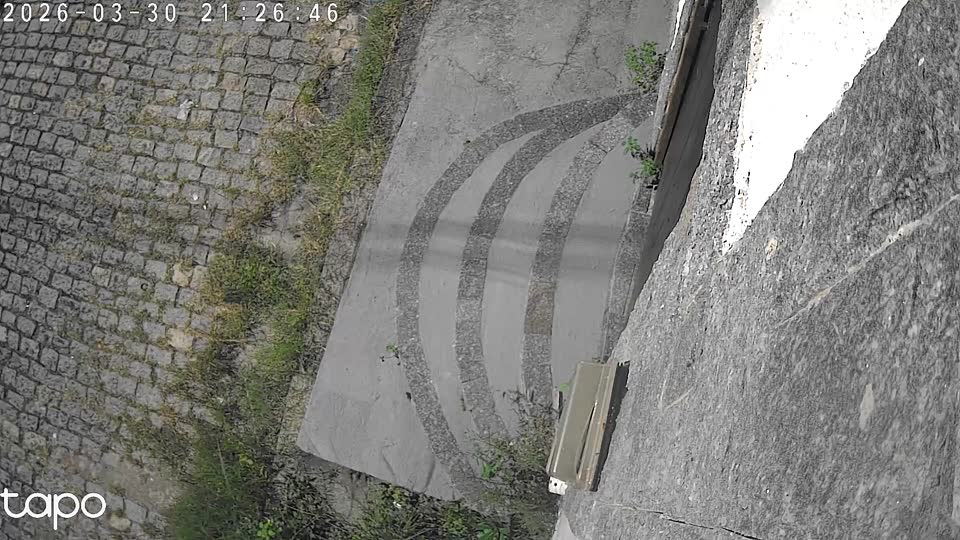
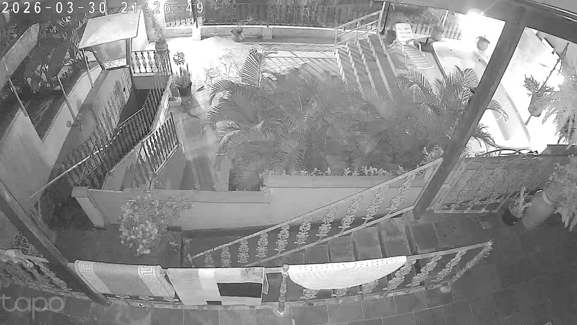

# SmartRogaciano


> A personal smart home platform built with Home Assistant, floorplan-based control, low-cost device integrations, and a custom Chromecast dashboard pipeline.

A personal smart home project focused on building a practical, low-cost home automation stack with the tools and devices already available in the house.

This repository documents a real Home Assistant environment running on Docker for Windows, combining floorplan-based control, Tapo cameras, Tuya devices, and a custom Chromecast delivery workflow. The goal is not to build a perfect lab setup. The goal is to build something reliable, maintainable, and useful in everyday life.

## Project identity

`SmartRogaciano` is the public-facing name of this project.

It represents a practical smart house platform built around:

- Home Assistant as the automation core
- a real floorplan as the interaction layer
- low-cost integrations such as Tapo and Tuya
- a custom TV delivery flow for large-screen monitoring

Short GitHub description:

`A personal smart home project using Home Assistant, SVG floorplans, Tapo, Tuya, and a custom Chromecast dashboard service.`

## Vision

SmartRogaciano is an incremental smart house project built around three ideas:

- start with limited resources instead of waiting for a full premium ecosystem
- integrate devices automatically whenever possible, even across different vendors
- turn the result into a dashboard that is useful outside the admin panel, especially on a TV

This project treats the house as a living system that can evolve over time:

- devices can be added gradually
- mappings can be refined without redesigning the whole setup
- missing integrations can be represented with helpers until real entities exist
- dashboards remain versioned and understandable as the house grows

## What the project delivers

- Home Assistant in Docker with persistent local configuration
- a real SVG floorplan connected to Home Assistant state
- Tapo camera integration and RTSP-based TV delivery
- Tuya integration for lights, switches, fan/light modules, and sensors
- a dedicated TV dashboard service called `castwall`
- Chromecast delivery with recovery logic and runtime quality profiles
- network-aware host IP selection for mixed Ethernet and Wi-Fi environments

## Visual preview

The images below were exported from the current `castwall` dashboard assets and reflect the real project layout used for TV delivery.

| Floorplan | Street camera | Porch camera |
|---|---|---|
|  |  |  |

## Core stack

### Platform

- `Home Assistant`
- `Docker Compose`
- `Windows host`

### Integrations

- `TP-Link Tapo`
- `Tuya`
- `Google Cast / Chromecast`

### Custom components and implementation

- `castwall`
  - custom Flask service
  - uses `ffmpeg` to capture RTSP snapshots
  - uses `pychromecast` to control the Chromecast session

- `ha-floorplan`
  - SVG floorplan rendered from Home Assistant state

- `YAML dashboards`
  - explicit Lovelace configuration for floorplan and TV flows

- custom CSS and mappings
  - room overlays
  - device state styling
  - alert and stale-camera visual states

## Feature set

### 1. Persistent Home Assistant deployment

- Home Assistant runs inside Docker and keeps its configuration under `config/`
- the project is meant to survive host restarts without losing the dashboard setup
- the repository stores the maintainable configuration, not volatile runtime state

### 2. Real house floorplan

- the house is modeled with a real SVG floorplan
- the SVG is published through Home Assistant static assets
- the floorplan is mapped to entities through YAML rather than hardcoded logic
- all rooms in the floorplan can exist even before they have real devices attached

### 3. Complete room coverage through helpers

- the project creates helper entities for all areas represented in the floorplan
- this allows the dashboard to stay structurally complete from day one
- rooms can be automated later without changing the dashboard model

### 4. Device-to-floorplan mapping

- every visible device marker in the floorplan is mapped to a Home Assistant entity
- mappings are stored in dedicated YAML files for maintainability
- mappings support real integrations first and helper placeholders when a device is not integrated yet

### 5. State-based visual rendering

- the floorplan uses Home Assistant state to style devices and rooms
- lights, fans, climate placeholders, media targets, and cameras have visual state classes
- unavailable devices remain visually distinct from devices that are intentionally off

### 6. Tapo camera integration

- Tapo cameras are integrated into Home Assistant
- live-view entities can be used where available
- a more stable RTSP/TCP path can be used when needed for camera delivery workflows
- camera state is reused both in Home Assistant and in the TV dashboard

### 7. Tuya device integration

- Tuya is used to discover and integrate practical smart devices already present in the house
- current usage includes switch modules, fan/light modules, and sensors
- Tuya entities are reused in the floorplan whenever they provide the best operational state

### 8. TV-friendly dashboard generation

- the project includes a dedicated dashboard flow for large-screen visualization
- the TV layout combines floorplan context and camera monitoring
- the design is optimized for legibility and stability, not just feature density

### 9. Custom `castwall` service

`castwall` is the main custom piece of the project. It is responsible for turning Home Assistant state and camera media into a practical Chromecast dashboard.

Main responsibilities:

- capture camera snapshots from RTSP sources
- publish a lightweight local dashboard
- merge floorplan state with camera panels
- expose control endpoints for Home Assistant
- send the dashboard to Chromecast

### 10. Chromecast delivery workflow

- Home Assistant starts the TV dashboard through `rest_command`
- `castwall` discovers the Chromecast and opens the dashboard on it
- the current validated workflow uses `CAST_MODE=direct`
- the dashboard is delivered locally rather than relying on a public cloud dashboard

### 11. Cast watchdog and self-recovery

The Chromecast workflow includes internal recovery logic:

- detects when the Chromecast leaves the expected app/session
- attempts recovery only while casting is still desired
- respects manual stop actions
- retries after temporary network instability
- uses short discovery and socket timeouts to avoid long dead periods

This makes the TV dashboard much more resilient than a one-shot cast command.

### 12. Runtime quality profiles

The TV dashboard supports runtime quality profiles:

- `economy`
- `normal`
- `near_live`

These profiles control:

- snapshot interval
- visual refresh cadence
- image width / quality trade-off

Profiles can be changed at runtime without rebuilds and are persisted by `castwall`.

### 13. Home Assistant scripts for TV control

The project exposes scripts such as:

- `mostrar_cameras_na_tv`
- `parar_cameras_na_tv`
- `perfil_dashboard_tv_economia`
- `perfil_dashboard_tv_normal`
- `perfil_dashboard_tv_quase_live`

This means the custom TV flow remains controllable from inside Home Assistant instead of being a separate tool.

### 14. Automatic dashboard start when the TV wakes up

The project includes a Home Assistant automation that:

- watches the Chromecast entity
- detects when it becomes reachable again
- waits a short stabilization window
- automatically starts the TV dashboard if the helper is enabled

This is an important quality-of-life feature because the system can recover from normal TV power cycles with less manual interaction.

### 15. Camera freshness monitoring

The TV dashboard does not only show images. It also tracks how healthy those images are.

Derived camera states include:

- `fresh`
- `stale`
- `offline`

Those states are used to:

- label camera cards
- style floorplan camera markers
- differentiate between a healthy feed and an outdated image

### 16. Event-driven floorplan refresh

- the dashboard can consume floorplan state through a continuous stream endpoint
- when that is not stable enough for the target browser/device, it can fall back to lightweight polling
- this allows state updates to stay responsive without overloading the display pipeline

### 17. Motion and alert overlays

The floorplan supports separate alert logic, not just normal state logic.

Examples:

- motion-related highlights
- camera-related alert helpers
- room-level alert classes with higher visual priority

This gives the dashboard an operational monitoring role, not just a static control role.

### 18. Mixed network awareness

This project was built for a host that may use:

- `Ethernet` for general computer use
- `Wi-Fi` for mesh-network devices such as Chromecast and cameras

Because of that, the project includes a network selection script that:

- inspects the host interfaces
- ignores virtual interfaces when needed
- checks target IPs from the environment
- prefers the most appropriate local IPv4 route for the dashboard

This avoids manual reconfiguration whenever the casting path depends on Wi-Fi but the computer is also connected by cable.

### 19. Clear repository boundaries

The repository is designed for long-term maintenance:

- configuration and logic are versioned
- secrets stay in `.env.local`
- volatile Home Assistant internals remain outside Git
- generated runtime artifacts are excluded

This makes the repo suitable both as a working project and as technical portfolio material.

## Architecture summary

The stack currently revolves around two services:

- `homeassistant`
  - the main automation and state platform
  - persistent configuration under `config/`

- `castwall`
  - the local delivery service for TV dashboards
  - camera snapshot pipeline
  - Chromecast control
  - quality profile management

High-level flow:

1. Home Assistant stores and exposes the current house state.
2. Tapo and Tuya integrations feed entities into Home Assistant.
3. The floorplan maps those entities to SVG elements.
4. `castwall` reads Home Assistant state and camera snapshots.
5. `castwall` serves a TV-friendly page.
6. Chromecast opens that page and keeps receiving refreshes.

## Repository structure

- `docker-compose.yml`
  - starts `homeassistant` and `castwall`

- `config/`
  - versioned Home Assistant configuration
  - YAML dashboards
  - floorplan assets and mappings
  - scripts, automations, helpers, and Lovelace files

- `castwall/`
  - custom Flask application for TV dashboard delivery

- `scripts/`
  - local startup and network utility scripts

- `media/`
  - local media mounted into Home Assistant

## Main configuration assets

- `config/configuration.yaml`
- `config/scripts.yaml`
- `config/automations.yaml`
- `config/floorplan/mapeamento.yaml`
- `config/floorplan/floorplan.yaml`
- `config/www/floorplan/rogaciano.svg`
- `config/www/floorplan/rogaciano.css`
- `castwall/app.py`

## Running the project locally

1. Copy `.env.example` to `.env.local`
2. Fill in local values such as:
   - Chromecast name/IP
   - `PUBLIC_URL`
   - RTSP camera endpoints
   - quality profile defaults
3. Start the stack:

```powershell
docker compose up -d
```

Then open:

- `http://localhost:8123`

## Environment variables

`.env.local` is expected to hold machine-specific or sensitive values, such as:

- `CHROMECAST_KNOWN_HOSTS`
- `CHROMECAST_NAME`
- `PUBLIC_URL`
- `SNAPSHOT_BASE_URL`
- `HOME_ASSISTANT_URL`
- `CAST_MODE`
- `CAMERA_RUA_RTSP`
- `CAMERA_VARANDA_RTSP`
- `DEFAULT_QUALITY_PROFILE`
- watchdog and timeout settings

The template file is available in:

- `.env.example`

## Git policy

Included in Git:

- custom service code
- versioned Home Assistant configuration
- floorplan assets
- mappings, helpers, dashboards, and scripts
- technical documentation

Excluded from Git:

- `.env.local`
- `config/.storage/`
- `config/.cache/`
- Home Assistant databases and logs
- generated runtime artifacts under `config/www/castwall/`

## Additional documentation

- `CASTWALL-ARCHITECTURE.md`

## Practical notes

- the project is intentionally incremental
- the dashboard is optimized for operational stability first
- the floorplan uses real Home Assistant state whenever possible
- placeholders are acceptable when they preserve system structure and make future integrations easier
- the project is meant to evolve with the house rather than be finished all at once
